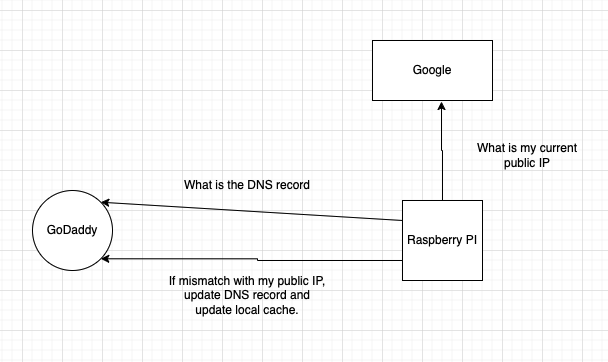

# Goddaddy dynamic IP
A simple process to keep your Goddaddy DNS A record synchronised with your home dynamic IP.

## Usage
```
RUST_LOG=info API_KEY=<KEY> API_SECRET=<SECRET> BASE_PATH=https://api.godaddy.com/v1 RECORD_NAME=<DNS record name> cargo run
```


## Process Architecture



